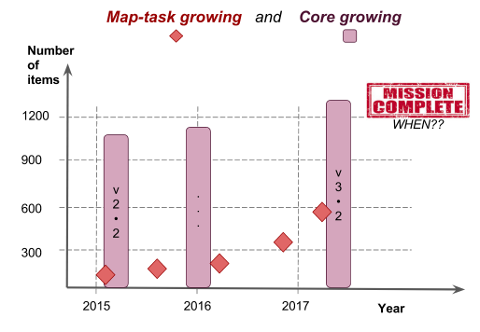

# schemaOrg-bdMaps

We are a task force of organized voluntaries supported by [OKBr](http://ok.org.br) and [DBpedia](http://www.dbpedia-spotlight.org), that are linking the most popular ontologies of the Web, Wikidata and SchemaOrg.  Our main tasks are:
1. to map (to link) the [SchemaOrg's vocabulary](https://schema.org/) into Wikidata;
2. to map  the [Wikidata's vocabulary](https://Wikidata.org/) into SchemaOrg;
3. offer a well-founded methodology for taks 1 and 2.

Documentation shortcuts:

* [Quering-Wikidata and installing SQL tool](docs/quering-Wikidata.md)
* [Wikidata state summarizations](docs/reports.md)

## Presentation
Our focus is  the "core ontology" of [Schema.Org](http://schema.org). Today, as stated by [schema.org/docs](http://schema.org/docs/schemas.html) of version 3.3,

> The core vocabulary currently consists of 597 Types, 875 Properties, and 114 Enumeration values.

So, there are **~1500 items to be mapped** (~600 types + ~900 properties), in both Wikidata-side source codes and SchemaOrg-side [source code](https://github.com/schemaorg/schemaorg/blob/master/data/releases/3.3).

The first aim was expressed as SchemaOrg's [issue-280](https://github.com/schemaorg/schemaorg/issues/280), *"Schema.org should have mappings to Wikidata terms where possible"* ([Dan Brickley](https://github.com/danbri) - coordinator).

This project intends to enhance the SchemaOrg core items definitions, citing in each core item its corresponding Wikidata item (e.g., add Wikidata-ID in the text of RFD-comment or linking explicitally adding RDF-statement to the external equivalent), and to link SchemaOrg items in the source code of corresponding Wikidata items.

### Motivations

There are some consensus about mappig task in the "full community", but the production of results was growing slowly,

And the initial goal changed from "map SchemaOrg to Wikidata" to "map Wikidata to SchemaOrg", causing some confusion in the team and lost of voluntaries... After two years and some work, we (a little group of voluntaries) noticed again that we need the initial goal.

In this project we want to join the two sides of the bridge!

Wikidata and SchemaOrg also represent two choices of concept-semantic definition strategies, [extensional and intensional](https://en.wikipedia.org/wiki/Extensional_and_intensional_definitions):

* *SchemaOrg definition approach* is straightforward and pragmatic. A short phrase intentionally defines each entry (class or property), and the real concept is built extensionally by the community of users, with extension at initial samples or statistics of use.

* *Wikidata definition strategy* is based on Wikipedia. All entries (mainly stable classes) define intention associating an item with corresponding Wikipedia's entry.

So, providing SchemaOrg-side, we enhance the correct use and avoid confusion for SchemaOrg users.  Providing wikidata-side, we improve Wikidata definition and offer access to Wikidata users the biggest [semantic *corpus* sampler](https://en.wikipedia.org/wiki/Corpus_linguistics) of the Web.

## Tasks and status

* Check it out on our [PROJECT PAGE](https://github.com/okfn-brasil/schemaOrg-Wikidata-Map/projects/1)

### Working on SchemaOrg side

* To establish a convention (methodology) for inclusion of the definitional Wikidata-link in the RDF SchemaOrg item.
* To include (where possible), in the "core SchemaOrg", the links

### Working on Wikidata side
...
See  also [Wikidata's Guidelines for external relationships](https://www.wikidata.org/wiki/Help:Statements/Guidelines_for_external_relationships#schema_case).
...

### Working with DBpedia methodology

... using "mapping vocabularies"  experience of DBpedia experts... best practices and final automation ...

### Initial and target situations in 2017
...

